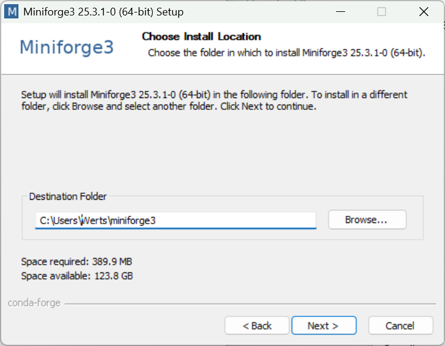
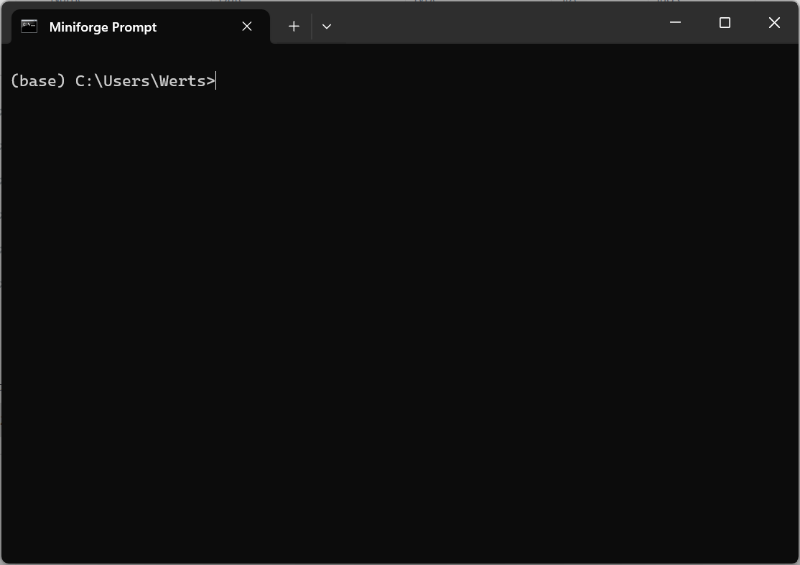

# Installation de Miniconda3, Jupyter Notebook, Python scientifique et bibliothèques logicielles spécifiques département mécatronique (Windows, OS X, Linux)

*Ecole normale supérieure de Rennes*

version du 17 août 2021 (**en cours de révision**)

La version la plus récente de ce document: [https://github.com/mhvwerts/Python-mecatronique](https://github.com/mhvwerts/Python-mecatronique).

## Remarques générales

Afin de pouvoir garantir que tou.te.s les élèves en mécatronique
disposent du même environnement informatique pour l'utilisation de
Python scientifique et de Jupyter Notebook, nous vous demandons de bien
suivre les instructions spécifiques dans ce document. Elles visent
l'installation de

1.  l'environnement "[Miniconda 3](https://docs.conda.io/en/latest/miniconda.html)",
    configuré pour travailler exclusivement avec le dépôt logiciel
    "[Conda-forge](https://conda-forge.org/)"

2.  la pile [Python scientifique standard](https://www.scipy.org/): Python 3, numpy, scipy,
    matplotlib

3.  [Jupyter Notebook](https://jupyter.org/)

4.  bibliothèques logicielles spécifiques:
    [CoolProp](http://www.coolprop.org/),
    [Fipy](https://www.ctcms.nist.gov/fipy/)

La procédure conduira à l'installation de tous ces éléments. Elle a été
pensée pour laisser la possibilité de facilement installer d'autres
programmes ultérieurement pour des cours avancés, par ex. en
prépa-agreg.

Ce document décrit la procédure d'installation pour Windows. Pour Apple
OS X et Linux, les procédures sont similaires. Une fois l'interface en
ligne de commande ouverte, avec l'environnement Anaconda/Miniconda
activé, les instructions sur les trois systèmes sont identiques.

**Nota bene 1.** *Notre conseil est d'utiliser* **Python 3.7** *afin de garantir la meilleure compatibilité. Cherchez donc à installer cette version stable.*
 
**Nota bene 2.** *Nous sommes conscients que d'autres procédures d'installation sont envisageables, mais nous ne pouvons pas garantir leur pertinence. Nous ne serons pas en mesure de vous aider en cas de problèmes avec ces procédures. En revanche, si vous avez du succès avec votre propre méthode, n'hésitez pas à la partager avec nous.*

En cas de questions ou problèmes, contactez Martin Werts ou Lancelot Barthe (par mél, par exemple).

<div style="page-break-after: always"></div>

## 1. Installation, partie 1 (spécifique au système d'exploitation)


**Avant d'installer Miniconda3, supprimez toute installation antérieure
de Anaconda ou Miniconda de votre système.**

Ici suivront les instructions spécifiques pour Windows. Les procédures pour OS X et Linux
sont similaires. Les particularités de l'installation sur ces deux systèmes-là sont décrites en bas.

### 1.1. Windows

#### 1.1.1. installation Miniconda3 (Python 3.7)

Visitez le lien:
[https://docs.conda.io/en/latest/miniconda.html](https://docs.conda.io/en/latest/miniconda.html)
pour le logiciel d'installation de "Miniconda3".

(i) Téléchargez et exécutez **Python 3.7 - Miniconda3 Windows 64-bit**.

<!--  -->


Après démarrage du programme, il y a une suite de fenêtres avec quelques
options à choisir. Nous suivrons en principe les options par défaut.

(ii) cliquez **'Next'** --- (iii) cliquez **'I Agree'**

<!--   -->

...

<div style="page-break-after: always"></div>

(iv) choissez '**Just Me'**, cliquez **'Next'** (v) répertoire
d'installation, cliquez **'Next'**

<!--  -->

...


(vi) **NON**: "Add Miniconda3 to PATH" --- (vii) Après '**Install**',
cliquez **'Next'**

**OUI**: "Register Miniconda3 as default"

<!--   -->

...


Au final, vous aurez des propositions pour regarder un tutoriel
(choisissez **NON**) et pour vous faire parvenir des news (choisissez
**NON**). Après avoir fermé la dernière fenêtre, l'installation de
Miniconda3 est terminée, ce qui vous permettra de passer aux étapes
suivantes.

<div style="page-break-after: always"></div>

#### 1.1.2. Ouvrir une fenêtre avec l'interface en ligne de commande, environnement "Anaconda/Miniconda" activé.

Ouvrez le menu principal/la barre de recherches dans Windows, et
cherchez "**Anaconda Prompt (miniconda3)**"

<!--  -->


Ouvrez cette application "**Anaconda Prompt (miniconda3)**" pour
retrouver l'interface en ligne de commande pour la suite des opérations.

<!--  -->


<div style="page-break-after: always"></div>


### 1.2. Particularités pour OS X

*Sébastien Gardette a utilisé cette procédure d'installation avec succès.*

Visitez le lien:
[https://docs.conda.io/en/latest/miniconda.html](https://docs.conda.io/en/latest/miniconda.html)
pour le logiciel d'installation de "Miniconda3".

Téléchargez et exécutez **Miniconda3 MacOSX 64-bit pkg (Python 3.7)**. Suivez les instructions, en vous référant aux instructions Windows pour choisir les options.

Ouvrez une fenêtre "Terminal" ou "Miniconda Prompt" (interface en ligne de commande) pour la suite ("Installation, partie 2").


### 1.3. Particularités pour Linux

**IMPORTANT** *Il n'est pas nécessaire (c'est même déconseillé) d'installer Miniconda3 avec des privilèges "administrateur de système". Evitez donc ``sudo``.*

Visitez le lien:
[https://docs.conda.io/en/latest/miniconda.html](https://docs.conda.io/en/latest/miniconda.html)
pour le logiciel d'installation de "Miniconda3". La version à installer est "Miniconda3 Linux 64-bit (Python 3.7)".

Des [instructions pour installer](https://docs.conda.io/projects/conda/en/latest/user-guide/install/linux.html) sont disponibles sur le site oueb de Conda. En particulier, pour exécuter le script d'installation on peut utiliser (ligne de commande, avec le répertoire de téléchargement comme répertoire de travail).

```
bash Miniconda3-py37_4.10.3-Linux-x86_64.sh
```

Répondre aux questions suivant les indications données pour l'installation Windows. *Attention* en particulier de bien répondre "YES" à la question “Do you wish the installer to initialize Anaconda3 by running conda init?” (sauf si vous avez vraiment une bonne raison pour répondre "NON"...)

Pour commencer la partie 2 de l'installation, il faut fermer la fenêtre Terminal et en ouvrir une autre.


#### Suggestion de Claire Livet

Cela arrive facilement de répondre "NON" de façon non intentionnelle à la question sur l'initialisation. Dans ce cas:


> If you enter “no”, then conda will not modify your shell scripts at all. In order to initialize after the installation process is done, first run ``source <path to conda>/bin/activate`` and then run ``conda init``.


## 2. Installation, partie 2 (identique pour Windows, OS X, Linux)

Dans cette partie, nous suivrons une approche "pas à pas" prudente. En
particulier, l'installation de scipy prendra un certain temps et donnera
probablement lieu à quelques "warnings" (ne pas en tenir compte). C'est
à ce moment-là que des mises à jour seront installées. Vous aurez aussi
des messages de type "Solving environment: failed with initial frozen
solve. Retrying with flexible solve.". Ces messages seront sans
incidence sur le succès ultime de l'opération.

Dans l'interface en ligne de commande, faites exécuter successivement
les instructions suivantes. Une connexion Internet est nécessaire, car
les instructions "conda install" conduiront au téléchargement des
composants logiciels réquis. **N'oubliez surtout pas les deux premières
instructions "conda config"**.

```
conda config --add channels conda-forge

conda config --set channel_priority strict

conda install scipy

conda install matplotlib

conda install notebook

conda install spyder

conda install coolprop

conda install fipy
```

Après téléchargement et installation de tous les composants, vous
disposerez d'une pile "Python mécatronique" complète (et extensible).

Essayez ensuite (toujours en ligne de commande), par exemple, la
commande

```
jupyter notebook
```

Cette commande devrait conduire à l'activation de votre logiciel de
navigation Internet (Firefox, Edge, Chrome, ...) avec une fenêtre
ouverte sur la page d'accueil du serveur Jupyter Notebook (ce serveur
tourne 'localement', c'est à dire, directement sur votre ordinateur et
exclusivement accessible à partir de votre ordinateur).

Sur les pages suivantes, il y a quelques indications à propos de la
prise en main des outils Python mécatroniques que vous venez
d'installer.

<div style="page-break-after: always"></div>

## 3. Prise en main et premiers essais

*Les indications ci-dessous sont basées sur une utilisation avec
Windows. Les utilisa.teurs.trices de OS X et Linux sont sans doute assez
intelligent.e.s et débrouillard.e.s pour les adapter à la volée. En cas
de questions, n'hésitez pas à contacter Martin Werts.*

Vous vous servez de dossiers/répertoires sur votre ordinateur pour
organiser vos fichiers. De façon générale, il est fortement conseillé de
démarrer Jupyter Notebook et Python "dans" le dossier/répertoire dans
lequel se trouvent les fichiers pertinents. Il faut donc changer le
répertoire de travail de l'interface en ligne de commande. Ceci est
fait par la commande "cd" (pour "change directory"). *C'est la même
commande dans les cas OS X et Linux.*

Par exemple, vous avez créé (avec l'explorateur Windows) un sous-dossier
dans votre dossier "Documents" intitulé "my-first-notebooks". Pour
"aller" à ce répertoire via la ligne de commande, il faut donner la
commande:

```
cd /Users/<votre nom d'utilisateur>/Documents/my-first-notebooks
```

Vous pouvez obtenir le chemin précis via l'explorateur Windows, avec un
"clique droite" sur le répertoire et sélectionnant soit "Propriétés" ou
"Copier l'adresse en tant que texte", le cas échéant.

Une commande utile pour vérifier que vous êtes bien arrivé.e à bon port
est "dir", ce qui affiche le contenu du répertoire (du dossier). *La
commande équivalente OS X/Linux est* "ls".

1. Téléchargez les deux notebooks suivants, et placez-les dans votre
répertoire "my-first-notebooks".

```
"Example 1 - A Rankine cycle with CoolProp.ipynb"

"Example 2 - Scipy special functions and Fipy.ipynb"
```

2. Ouvrez l'application "**Anaconda Prompt (miniconda3)**" pour
retrouver l'interface en ligne de commande.

3. Utilisez la bonne commande "cd" pour rendre ce répertoire
"my-first-notebooks" le répertoire de travail pour la ligne de commande.

4. Démarrez le Jupyter Notebook:

```
jupyter notebook
```

5. Ouvrez les fichiers Notebook en utilisant la page d'accueil de
Jupyter Notebook dans votre navigateur.

6. Jouez.

<div style="page-break-after: always"></div>

## Remarks about this document


The source of this document is in GitHub-flavoured Markdown (``.md``). A DOCX version can be generated using [Pandoc](https://pandoc.org).

```
pandoc mektro2021_2022_installation_scientific_python_gfm.md -f gfm -t html5 -s -o mektro2021_2022_installation_scientific_python_intermediate.html

pandoc mektro2021_2022_installation_scientific_python_intermediate.html -f html -t docx -s -o mektro2021_2022_installation_scientific_python_gfm.docx
```

A ``PDF`` file can be generated using [Pandoc](https://pandoc.org).

```
pandoc mektro2021_2022_installation_scientific_python_gfm.md -f gfm -t html -s -o mektro2021_2022_installation_scientific_python_gfm.pdf
```


## To-do's
- Create a Makefile to generate the PDF and DOCX, *e.g.* ``make pdf``
- Fix the layout on the generated DOCX and PDF documents.
