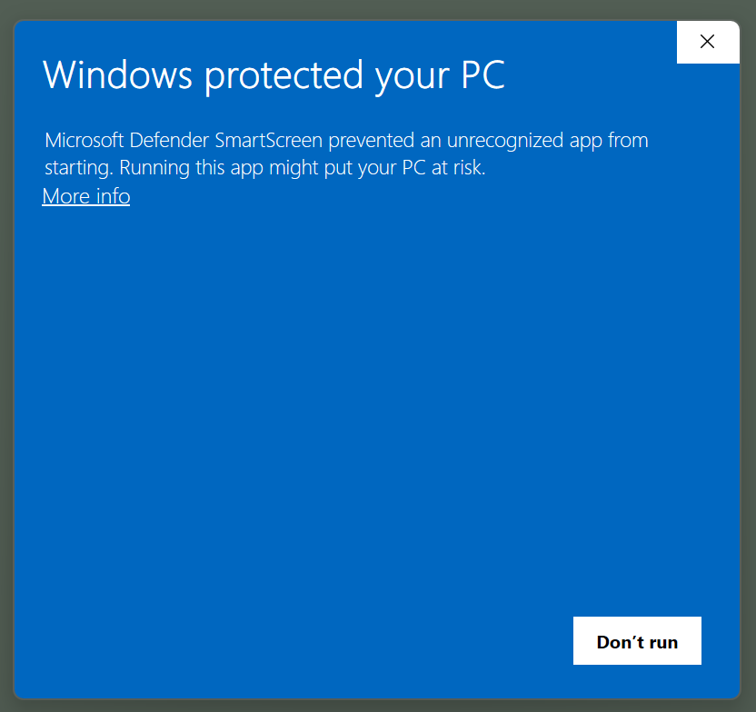
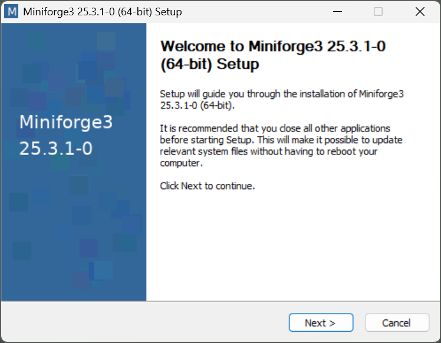
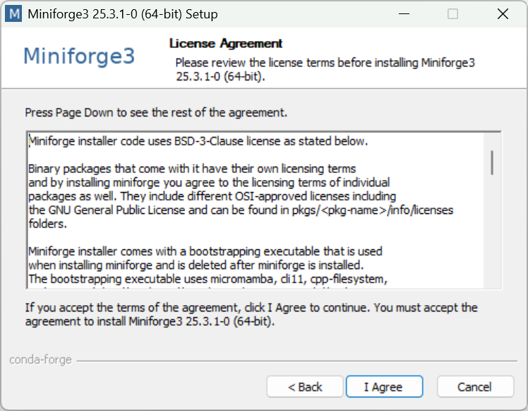
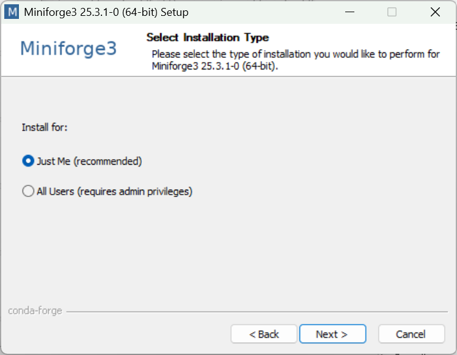
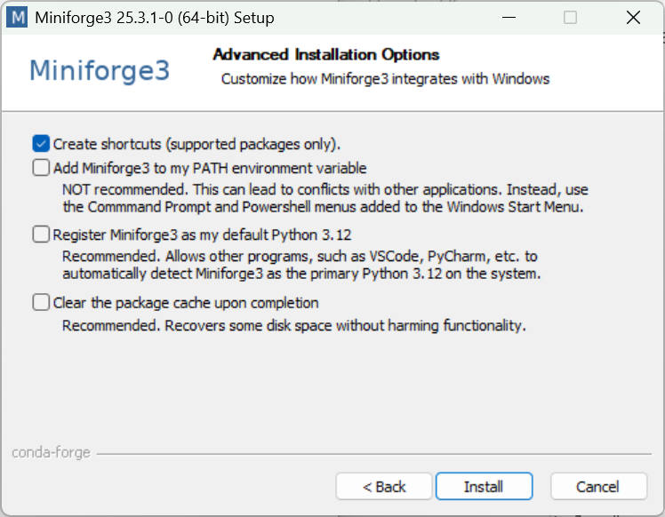
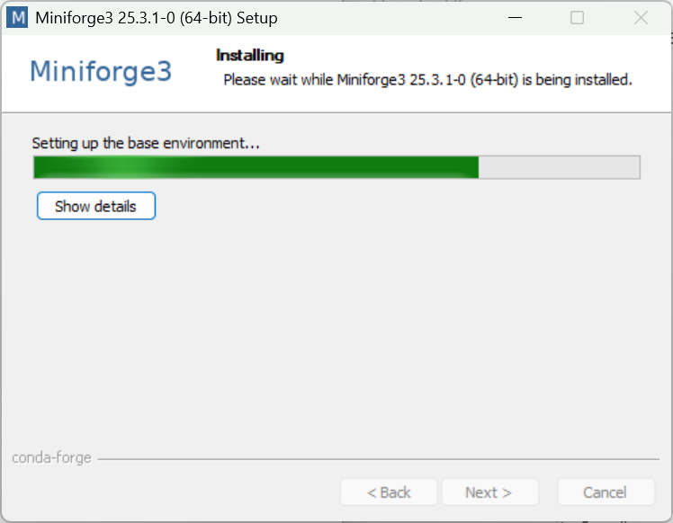

# Installation de Miniforge3, Jupyter Notebook, Python scientifique et bibliothèques logicielles spécifiques département mécatronique (Windows, OS X, Linux)

version du 1er septembre 2025

La version la plus récente de ce document: [https://github.com/mhvwerts/Python-mecatronique](https://github.com/mhvwerts/Python-mecatronique).

## Remarques générales

Afin de pouvoir garantir que tou.te.s les élèves en mécatronique
disposent du même environnement informatique pour l'utilisation de
Python scientifique et de Jupyter Notebook, nous vous demandons de bien
suivre les instructions spécifiques dans ce document. Elles visent
l'installation de

1.  l'environnement "[Miniforge 3](https://conda-forge.org/download/)",
    configuré pour travailler exclusivement avec le dépôt logiciel
    "[Conda-forge](https://conda-forge.org/)"

2.  la pile [Python scientifique standard](https://www.scipy.org/): Python 3, NumPy, SciPy, Matplotlib

3.  [Jupyter Lab](https://jupyter.org/)

4.  bibliothèques logicielles spécifiques:
    [CoolProp](http://www.coolprop.org/),
    [PyFVTool](https://github.com/FiniteVolumeTransportPhenomena/PyFVTool)

La procédure conduira à l'installation de tous ces éléments. Elle a été
pensée pour laisser la possibilité de facilement installer d'autres
programmes ultérieurement pour des cours avancés, par ex. en
prépa-agreg.

Ce document décrit la procédure d'installation pour Windows. Pour Apple OS X et Linux, les procédures sont similaires. Une fois l'interface en
ligne de commande ouverte, avec l'environnement Miniforge activé, les instructions sur les trois systèmes sont identiques.

**Nota bene 1.** *Notre consigne est d'utiliser* **Python 3.12** *afin de garantir la meilleure compatibilité.*
 
**Nota bene 2.** *Nous sommes conscients que d'autres procédures d'installation sont envisageables, mais nous ne pouvons pas garantir leur pertinence. Nous ne serons pas en mesure de vous aider en cas de problèmes avec ces procédures. En revanche, si vous avez du succès avec votre propre méthode, n'hésitez pas à la partager avec nous.*

<div style="page-break-after: always"></div>

## 1. Installation, partie 1 (spécifique au système d'exploitation)


**Avant d'installer Miniforge3, supprimez toute installation antérieure
de Anaconda, Miniconda ou Miniforge de votre système.**

Ici suivront les instructions spécifiques pour Windows. Les procédures pour OS X et Linux sont similaires. Utilisez le plus possible les réglages 'par défaut'.

### 1.1. Windows

#### 1.1.1. installation Miniforge3 (Python 3.12)

Visitez le lien:
[https://conda-forge.org/download/](https://conda-forge.org/download/)
pour le logiciel d'installation de "Miniforge3".

(i) Téléchargez et exécutez **Windows x86-64 Miniforge3 Windows 64-bit**.

<!--  -->


Windows affichera un avertissement que le programme provient d'une source inconnue. Vous pourrez sans problème choisir "More info" et ensuite "Run anyway"

<!--   -->

...


Après démarrage du programme, il y a une suite de fenêtres avec quelques
options à choisir. Nous suivrons en principe les options par défaut.


(ii) cliquez **'Next'** --- (iii) cliquez **'I Agree'**

<!--   -->

...


(iv) choissez '**Just Me'**, cliquez **'Next'** (v) répertoire
d'installation, cliquez **'Next'**

<!--  -->

...


(vi) **NON**: "Add Miniforge33 to PATH" --- (vii) Après '**Install**',
cliquez **'Next'**

**OUI**: "Register Miniforge3 as default"

<!--   -->

...


Après avoir fermé la dernière fenêtre, l'installation de
Miniforge3 est terminée, ce qui vous permettra de passer aux étapes
suivantes.


#### 1.1.2. Ouvrir une fenêtre avec l'interface en ligne de commande, environnement "Miniforge" activé.

Ouvrez le menu principal/la barre de recherches dans Windows, et
cherchez "**Miniforge Prompt**"

Ouvrez cette application "**Miniforge Prompt**" pour
retrouver l'interface en ligne de commande pour la suite des opérations.

<!--  -->


### 1.2. Particularités pour Linux

**IMPORTANT** *Il est déconseillé d'installer Miniforge3 avec des privilèges "administrateur de système". Evitez donc d'user de ``sudo``.*

*Attention* bien répondre "YES" à la question “Do you wish the installer to initialize Miniforge3 by running conda init?” (sauf si vous avez vraiment une bonne raison pour répondre "NON"...)

Pour commencer la partie 2 de l'installation, il faut fermer la fenêtre Terminal et en ouvrir une autre.


<div style="page-break-after: always"></div>


## 2. Installation, partie 2 (identique pour Windows, OS X, Linux)

Dans cette partie, nous suivrons une approche "pas à pas" prudente. En
particulier, l'installation de scipy prendra un certain temps (plusieurs minutes) et donnera peut-être lieu à quelques "warnings" (ne pas en tenir compte). Ces messages seront sans incidence sur le succès ultime de l'opération.

Dans l'interface en ligne de commande, faites exécuter successivement
les instructions suivantes. Une connexion Internet est nécessaire, car
les instructions "conda install" conduiront au téléchargement des
composants logiciels réquis. A un moment, il faudra répondre "yes" (ou "oui") pour continuer l'installation.

```
conda install python=3.12 scipy xarray matplotlib 
conda install notebook jupyterlab spyder tqdm pyserial h5py
```
(En principe, toutes ces bibliothèques pourraient être installées avec une seule commande; c'est un peu plus rapide)

Optionnellement, vous pouvez installer CoolProp et PyFVTool.

```
conda install coolprop
```

```
pip install git+https://github.com/FiniteVolumeTransportPhenomena/PyFVTool.git
```

Après téléchargement et installation de tous les composants, vous
disposerez d'une pile "Python mécatronique" complète (et extensible).

Essayez ensuite (toujours en ligne de commande), par exemple, la
commande

```
jupyter notebook
```

Cette commande devrait conduire à l'activation de votre logiciel de
navigation Internet (Firefox, Edge, Chrome, ...) avec une fenêtre
ouverte sur la page d'accueil du serveur Jupyter Notebook (ce serveur
tourne 'localement', c'est à dire, directement sur votre ordinateur et
exclusivement accessible à partir de votre ordinateur).

Sur les pages suivantes, il y a quelques indications à propos de la
prise en main des outils Python mécatroniques que vous venez
d'installer.


<div style="page-break-after: always"></div>

## 3. Prise en main et premiers essais

*Les indications ci-dessous sont basées sur une utilisation avec
Windows. Les utilisa.teurs.trices de OS X et Linux sont sans doute assez
intelligent.e.s et débrouillard.e.s pour les adapter à la volée.*

Vous vous servez de dossiers/répertoires sur votre ordinateur pour
organiser vos fichiers. De façon générale, il est fortement conseillé de
démarrer Jupyter Notebook et Python "dans" le dossier/répertoire dans
lequel se trouvent les fichiers pertinents. Il faut donc changer le
répertoire de travail de l'interface en ligne de commande. Ceci est
fait par la commande "cd" (pour "change directory"). *C'est la même
commande dans les cas OS X et Linux.*

Par exemple, vous avez créé (avec l'explorateur Windows) un sous-dossier
dans votre dossier "Documents" intitulé "my-first-notebooks". Pour
"aller" à ce répertoire via la ligne de commande, il faut donner la
commande:

```
cd /Users/<votre nom d'utilisateur>/Documents/my-first-notebooks
```

Vous pouvez obtenir le chemin précis via l'explorateur Windows, avec un
"clique droite" sur le répertoire et sélectionnant soit "Propriétés" ou
"Copier l'adresse en tant que texte", le cas échéant.

Une commande utile pour vérifier que vous êtes bien arrivé.e à bon port
est "dir", ce qui affiche le contenu du répertoire (du dossier). *La
commande équivalente OS X/Linux est* "ls".

1. Téléchargez les deux notebooks suivants, et placez-les dans votre
répertoire "my-first-notebooks". 

```
"Example 1 - A Rankine cycle with CoolProp.ipynb"

"Example 2 - Scipy special functions and PyFVTool.ipynb"
```
(Ces deux notebooks requièrent CoolProp et PyFVTool; ce n'est donc pas possible de les utiliser si vous n'avez pas installé ces deux bibliothèques.)

2. Ouvrez l'application "**Miniforge Prompt**" pour
retrouver l'interface en ligne de commande.

3. Utilisez la bonne commande "cd" pour rendre ce répertoire
"my-first-notebooks" le répertoire de travail pour la ligne de commande.

4. Démarrez le Jupyter Notebook:

```
jupyter notebook
```

5. Ouvrez les fichiers Notebook en utilisant la page d'accueil de
Jupyter Notebook dans votre navigateur. (Ou, si vous n'avez pas installé CoolProp et Fipy, créez un nouveau fichier Notebook Python 3)

6. Jouez.


<div style="page-break-after: always"></div>

## Remarks about this document


The source of this document is in GitHub-flavoured Markdown (``.md``). A LibreOffice ODT version can be generated using [Pandoc](https://pandoc.org).

```
pandoc mektro_installation_scientific_python_gfm.md -f gfm -t html5 -s -o mektro_installation_scientific_python_intermediate.html

pandoc mektro_installation_scientific_python_intermediate.html -f html -t odt -s -o mektro_installation_scientific_python_gfm.odt
```

A ``PDF`` file can be generated directly from the HTML using [Pandoc](https://pandoc.org). *Linux only*

```
pandoc mektro_installation_scientific_python_gfm.md -f gfm -t html --pdf-engine=wkhtmltopdf -s -o mektro_installation_scientific_python_gfm.pdf
```
